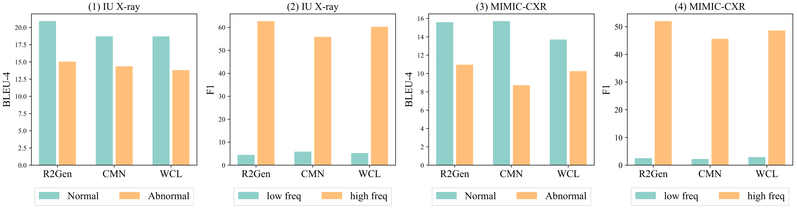
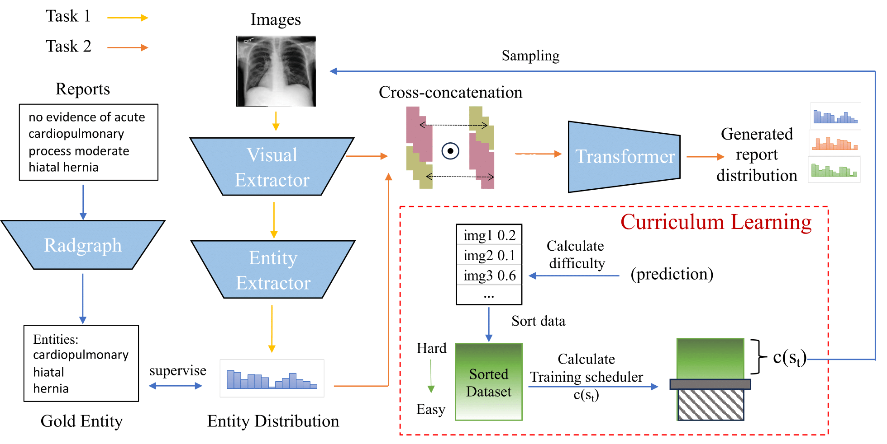

# Joint Imbalance Adaptation for Radiology Report Generation (JIMA)

Source codes for our paper "Joint Imbalance Adaptation for Radiology Report Generation" which addresses the data imbalance challenge in medical report generation.

## Citation

Please cite our work as:

```bibtex
@article{li2024jima,
  title={Joint Imbalance Adaptation for Radiology Report Generation},
  author={Li, Wang and Han, Guangzeng and Wu, Yuexin and Huang, I-Chan and Huang, Xiaolei},
  journal={[Journal Name]},
  year={2024},
  note={Under Review}
}
```

## Data Imbalance Challenge



Radiology report generation faces two critical imbalance challenges:
- **Token Imbalance**: Medical tokens appear less frequently than regular tokens, but contain crucial clinical information
- **Label Imbalance**: Normal cases dominate datasets (>85% in MIMIC-CXR), leading to poor performance on abnormal cases

This causes models to overfit on frequent patterns while underperforming on rare but clinically important cases.

## JIMA: A Joint Imbalance Adaptation Approach

We propose **J**oint **Im**balance **A**daptation (JIMA), a curriculum learning-based approach:
  
## Method Overview



JIMA employs a two-stage curriculum learning approach:
- **Entity Distribution Prediction**: Extracts clinical entities to guide report generation
- **Joint Feature Fusion**: Cross-concatenation and element-wise multiplication of image and entity features
- **Adaptive Training**: Dynamic sample selection based on difficulty assessment

## Experimental Results

### Key Performance Gains
- **IU X-ray**: 16.75%-50.50% average improvement, 72.10% clinical F1 improvement
- **MIMIC-CXR**: 9.59%-16.26% average improvement, 31.29% clinical F1 improvement
- **Imbalance Handling**: Significant improvements on low-frequency tokens and abnormal cases
- **Human Evaluation**: Medical experts prefer JIMA for clinical accuracy (32 vs 21 votes overall)

## Test Platform
Python 3.10, PyTorch 2.6, CUDA-enabled GPU recommended

## Experiment Preparation
1. **Environment Setup**:

   See ``requirements.txt``.

2. **Data Availability**:
   - Download IU X-ray dataset from [OpenI](https://openi.nlm.nih.gov/)
   - Download MIMIC-CXR dataset from [PhysioNet](https://physionet.org/content/mimic-cxr/)
   - Follow data preprocessing steps in `modules/datasets.py`

3. **Model Training**:

   **Note: Repalce the file_path OR dataset_name in ``script/train_iu_xray.slurm`` with your actual path.**
   ```bash
   # Joint training (recommended)
   cd script/
   sbatch train_iu_xray.slurm
   ```

4. **Evaluation**:
   ```bash
   cd script/
   sbatch plot_iu_xray.slurm
   ```

## License

This project is licensed under the MIT License - see the LICENSE file for details.

---
